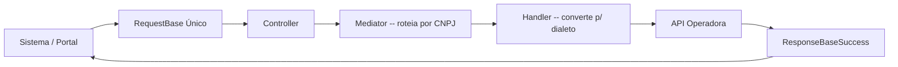

> **Esta é uma documentação do acesso direto ao Orquestrador Izzi.**
> Recomendamos usar a **OpenAPI Spec — o padrão RESTful** — em vez deste contrato
> legado. Veja a [Referência REST](/docs/referencia-rest) e a
> especificação interativa em [`/izzi-rest`](/izzi-rest).
>
> Use esta página apenas se precisar integrar diretamente com os endpoints `POST`
> originais do Orquestrador.
>
> **Postman:** existe uma [coleção Postman para o contrato legado](/docs/postman-orquestrador)
> com pedido de exemplo de **Inclusão** e **Auth - Gerar Token**, disponível para download.

## 1. Objetivo

Descrever a arquitetura e os detalhes de consumo e comunicação entre **aplicação
cliente**, **Orquestrador** e **operadora**.

## 2. O que é

A **API Orquestrador** funciona como um **Hub de Integração (Facade/Adapter)**
centralizado. Seu objetivo é abstrair a complexidade de comunicação com diversas
operadoras de planos de saúde e odontológicos (Bradesco, SulAmérica, Unimed, Amil,
etc.).

Em vez de o sistema cliente (um ERP Protheus, um portal de RH) precisar conhecer
as regras, URLs, tokens e formatos de payload de cada operadora, ele se comunica
**apenas com o Orquestrador**, usando um modelo de dados único e padronizado
(`RequestBase`).

**Principais finalidades:**

1. **Padronizar Movimentações Cadastrais:** Inclusão (`I`), Alteração (`A`),
   Exclusão (`E`), Troca de Plano (`T`) e Reativação (`R`) de vidas (titulares e
   dependentes).
2. **Consultar Dados:** Buscar beneficiários, movimentações e redes
   cadenciadas/locais na operadora.
3. **Automação de Faturas:** Intermediar chamadas para robôs (RPA) para download e
   interpretação de faturas quando a operadora não possui APIs públicas.
4. **Tratamento de Retornos:** Receber os status das operadoras de forma síncrona
   ou assíncrona (via WebHooks) e traduzir erros/sucessos para um formato comum.

## 3. Modelo conceitual e arquitetura

Baseado em **Roteamento Inteligente (Mediation)** e no princípio de **Adapters**
(Tradutores).



### 3.1. Autenticação e Multi-tenancy (inquilinos)

A plataforma atende múltiplos clientes. A entrada exige `ClientId`, `ClientSecret`
e `TenantId`, gerando um token JWT. O `appsettings.json` armazena as URLs e
credenciais de acesso para cada operadora atreladas àquele `TenantId`.

### 3.2. Entrada padronizada (`RequestBase`)

O sistema cliente monta um JSON padronizado com os dados do funcionário/dependente,
acompanhado da intenção (`movimento`) e do destino (`cnpjProvedor`).

### 3.3. Roteamento (padrão Mediator)

Quando o `OrquestradorController` recebe a requisição, ele a delega para a classe
`Mediator`, que atua como **chave de roteamento**:

- **Qual é a operadora?** (olha o CNPJ: Bradesco, SulAmérica, Unimed...)
- **Qual é a ação?** (olha o `movimento`: Inclusão, Exclusão...)

### 3.4. Handlers e conversões (o core do negócio)

Para cada combo (Operadora + Movimento) existe um **Handler** específico
(ex. `HandlerPostMovimentacoesVidasInclusoesBradesco`). Seu papel é:

- **Conversão de Request:** transformar o objeto genérico `RequestBase` nas
  classes exatas que a operadora de destino espera.
- **Integração:** realizar chamadas HTTP REST/SOAP para os barramentos das
  operadoras (ex. plataforma Sensedia da SulAmérica, endpoints do Bradesco).

### 3.5. Retorno padronizado (`ResponseBaseSuccess`)

Independentemente de como o provedor devolve os dados e os formatos de erro, a
resposta final trafega no formato comum `ResponseBaseSuccess`, mapeando:

- O **status HTTP**.
- Uma lista padronizada de **validações/erros** que a operadora acusou
  (ex. "CPF inválido", "Beneficiário inativo").
- O **payload original** (`requestJson`), para fins de rastreabilidade (auditoria).

### 3.6. Resumo do fluxo

```
Sistema/Portal → RequestBase Único → Controller → Mediator (roteia por CNPJ)
→ Handler (converte p/ dialeto da operadora) → API Operadora
→ converte p/ resposta padrão → Sistema/Portal
```

### 3.7. Modelo de comunicação

A aplicação cliente deve disparar a movimentação cadastral em intervalos regulares,
executando uma **autenticação inicial** para a criação de um token de acesso. Com
esse token é possível realizar as demais ações de envio de movimentação e consulta.

> A operadora requer um tempo de processamento — aconselha-se executar a
> movimentação cadastral e a busca por movimentações de forma **intercalada**.

## 4. Autenticação

Baseada no padrão **JWT (JSON Web Token)**. Antes de consumir qualquer endpoint de
negócio, o cliente precisa comprovar sua identidade e obter um token temporário.

A porta de entrada é o endpoint **`POST /api/orquestrador/gerar-jwt-para-acesso`**.
Ele possui a anotação `[AllowAnonymous]` — é o único local que não exige um token
prévio.

### 4.1. Payload de entrada (`RequestSignIn`)

| Campo | Descrição |
|---|---|
| `ClientId` | Identificador único do cliente. |
| `ClientSecret` | Chave secreta (senha) do cliente. |
| `TenantId` | Identificador do inquilino (cliente/empresa de destino). |

### 4.2. Retorno (`ResponseSuccessCreateJsonWebToken`)

Responde **`200 OK`** com:

- `token`: string JWT (Header, Payload, Signature).
- `dataCriacao`: data/hora em que o token foi gerado.
- `dataExpiracao`: data/hora de expiração (criação + 2 horas).

### 4.3. Como usar o token

Inclua-o no **Header HTTP** de todas as chamadas subsequentes aos endpoints
protegidos (`[Authorize]`):

```
Authorization: Bearer <TOKEN_AQUI>
```

## 5. Realizar a movimentação cadastral

O endpoint **`POST /api/orquestrador/realizar-integracao`** é o núcleo operacional.
Atua como tradutor universal: recebe um modelo padrão (agnóstico de operadora) e
devolve uma resposta também padronizada.

### 5.1. Request (`RequestBase`)

Dois campos são **obrigatórios** na raiz do JSON:

1. `cnpjProvedor`: define para qual operadora a requisição será roteada
   (ex. Bradesco, SulAmérica).
2. `movimento`: define o tipo de ação:
   - `I` (Inclusão)
   - `A` (Alteração)
   - `E` (Exclusão)
   - `T` (Troca de Plano)
   - `R` (Reativação)

**Nós condicionais:** dependendo do `movimento`, preenche-se blocos específicos:

- `movimento = "I"` → array `inclusao: [ ... ]` (titular e dependentes, endereço, etc.).
- `movimento = "A"` → objeto `alteracao: { ... }`.
- `movimento = "E"` → objeto `exclusao: { ... }`.

**Exemplo de payload de entrada (Inclusão):**

```json
{
  "cnpjProvedor": "33055146000193",
  "movimento": "I",
  "inclusao": [
    {
      "nome": "João da Silva",
      "cpf": "12345678900",
      "dataNascimento": "1990-01-01T00:00:00",
      "grauParentesco": "0",
      "endereco": { },
      "contato": { },
      "produto": { }
    }
  ]
}
```

### 5.2. A saída (`ResponseBaseSuccess`)

Independentemente do formato da operadora (XML legado, JSON da SulAmérica ou do
Bradesco), o Orquestrador converte tudo para um modelo único.

**Estrutura principal da saída:**

- `status`: código HTTP do processamento na operadora (ex. `200` sucesso,
  `400` erro de negócio).
- `movimentacoes`: lista consolidada com o resultado (número da carteirinha gerada,
  ID da transação).
- `validacoes`: lista de mensagens críticas ou erros devolvidos pela regra de
  negócio (ex. "CPF inválido", "Data de adesão fora da vigência").
- `requestURI`: URL exata da operadora chamada (auditoria).
- `requestJson`: payload exato traduzido e enviado à operadora.
- `responseContent`: retorno cru (raw) devolvido pela API da operadora.

**Exemplo de payload de saída:**

```json
{
  "status": 200,
  "movimentacoes": [
    { "nome": "João da Silva", "carteirinha": "888999900001111", "statusMovimentacao": "Processado com Sucesso" }
  ],
  "validacoes": [],
  "requestURI": "https://api.operadora.com.br/v1/inclusoes",
  "requestJson": { "nomeBeneficiario": "João da Silva", "doc_cpf": "12345678900" },
  "responseContent": "{ \"success\": true, \"id\": 9988 }"
}
```

## 6. Consultar o processamento das movimentações

O endpoint **`POST /api/orquestrador/buscar-movimentacoes`** centraliza a consulta
do **status e histórico** de movimentações (inclusões, alterações, exclusões)
enviadas previamente (atualmente suportando SulAmérica e Bradesco).

### 6.1. Request (`RequestBase`)

Mesmo JSON padrão, com atenção ao nó `consulta`. O `movimento` é preenchido com
`"C"` (Consulta).

**Campos obrigatórios:** `cnpjProvedor`, `movimento: "C"`, `consulta` (objeto com
os filtros).

**Filtros (`Consulta_RequestBase`)** mais utilizados:

- `apolice`: número da apólice/contrato.
- `empresa` / `cnpj`: dados da empresa estipulante.
- `cpf` / `cpfDependente`: filtra um beneficiário específico.
- `dataMovimentacaoApolice`: data ou período específico.
- `pagina` e `quantidadePorPagina`: paginação.

**Exemplo de payload de entrada:**

```json
{
  "cnpjProvedor": "01685053000156",
  "movimento": "C",
  "consulta": {
    "apolice": "12345",
    "empresa": "999999",
    "cpf": "12345678900",
    "dataMovimentacaoApolice": "2026-04-01",
    "pagina": "1",
    "quantidadePorPagina": "50"
  }
}
```

### 6.2. Response

Retorno padronizado que traduz o status atual das solicitações. Para cada vida
pesquisada, geralmente contém:

- **Status da movimentação:** em análise, processada com sucesso ou rejeitada (crítica).
- **Protocolo ou ID da transação:** número de rastreio gerado pela operadora.
- **Motivo/Crítica:** em caso de erro, o detalhe (ex. "Falta documento X",
  "Fora do prazo de vigência").
- **Dados básicos do beneficiário:** nome, CPF e número da carteirinha (se gerada).

```json
{
  "status": 200,
  "movimentacoes": [
    {
      "nome": "João da Silva",
      "cpf": "12345678900",
      "tipoMovimento": "Inclusão",
      "dataMovimentacao": "2026-04-01T10:30:00",
      "statusMovimentacao": "Processado com Sucesso",
      "numeroCarteirinha": "888999900001111",
      "criticas": []
    },
    {
      "nome": "Maria da Silva (Dependente)",
      "cpf": "09876543211",
      "tipoMovimento": "Inclusão",
      "dataMovimentacao": "2026-04-01T10:30:00",
      "statusMovimentacao": "Rejeitado",
      "numeroCarteirinha": null,
      "criticas": ["Data de nascimento incompatível com o grau de parentesco informado."]
    }
  ],
  "requestURI": "https://apisulamerica.../movimentacoes-vidas",
  "requestJson": { }
}
```

## 7. Conclusão: o ecossistema da API Orquestrador

A API Orquestrador foi arquitetada para ser o "coração" das integrações sistêmicas
de benefícios corporativos, atuando como um **Hub e Tradutor Universal
(Facade/Mediator)** entre sistemas clientes (Protheus, Hub RH) e as APIs das
operadoras.

Ela encapsula a complexidade, padroniza as entradas/saídas e fornece resiliência.
Para quem consome, não importa se o Bradesco mudar a versão da própria API ou se
uma nova operadora for adicionada — o contrato (`RequestBase` e
`ResponseBaseSuccess`) e a forma de consumo permanecem simples e inalterados.

> Para novas integrações, prefira a [Referência REST](/docs/referencia-rest), que
> expõe esse mesmo contrato em um modelo RESTful padronizado.
