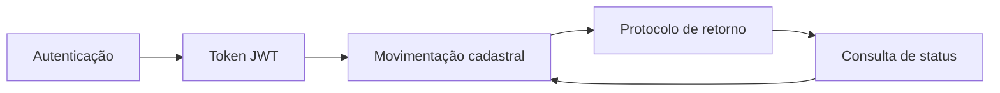

## Visão geral

Esta é a **API recomendada** para integrar com o Orquestrador de Benefícios da
Izii. É a versão **100% RESTful** do contrato — cada intenção de movimentação
cadastral é expressa pelo **verbo HTTP** e por um **recurso** próprio, em vez de
um único `POST` com um campo `movimento`.

> **Use esta API.** O acesso direto ao Orquestrador (endpoints `POST` legados)
> continua disponível para compatibilidade, mas a interface REST é o padrão
> oficial. Veja [Acesso Direto ao Orquestrador Izzi](/docs/orquestrador-izzi)
> apenas se precisar do contrato legado.

A especificação OpenAPI completa está disponível no portal em
[`/izzi-rest`](/izzi-rest), com playground **Try It Out**.

### Mapa de verbos

| Intenção (movimento legado) | Verbo REST | Recurso |
|---|---|---|
| Inclusão (`I`) | `POST` | `/v1/beneficiarios` |
| Alteração (`A`) | `PATCH` | `/v1/beneficiarios/{id}` |
| Troca de Plano (`T`) | `PUT` | `/v1/beneficiarios/{id}/plano` |
| Exclusão (`E`) | `DELETE` | `/v1/beneficiarios/{id}` |
| Reativação (`R`) | `POST` | `/v1/beneficiarios/{id}/reativacao` |
| Consulta de cadastro (`C`) | `GET` | `/v1/beneficiarios` · `/v1/beneficiarios/{id}` |
| Buscar movimentações | `GET` | `/v1/movimentacoes` · `/v1/movimentacoes/{id}` |

### Fluxo de consumo



---

## Conceitos fundamentais

### Base URL

| Ambiente | URL |
|---|---|
| Dev local | `http://localhost:8080` |
| Produção | `https://api.izii.com.br` |

Todos os caminhos abaixo usam o prefixo de versão `/v1`.

### Header de roteamento

A operadora de destino é informada no header **`X-Cnpj-Provedor`** (obrigatório em
todos os endpoints de negócio). Ele é a *chave de roteamento* — o Orquestrador usa
o CNPJ para decidir qual operadora chamar (Bradesco, SulAmérica, Unimed, etc.).

```
X-Cnpj-Provedor: 01685053000156
```

### Padrão de resposta

- **Operações de escrita** (`POST`, `PATCH`, `PUT`, `DELETE`, reativação) retornam
  um **`MovimentacaoResultado`** com `protocolo`, `status`, `criticas` e dados de
  auditoria (`requestJson`, `responseContent`).
- **Consultas** (`GET`) retornam o recurso ou uma **coleção paginada**
  (`data[]` + `paginacao`).
- **Erros** seguem o schema **`Erro`** (`status`, `codigo`, `mensagem`, `criticas[]`).
- Rejeições por regra de negócio da operadora retornam **`422`** com as `criticas`.

---

## Autenticação

A entrada exige `consumerKey`, `consumerSecret` e `tenantId`, que geram um **token
JWT** temporário com validade de **2 horas**. É o **único** endpoint público
(`[AllowAnonymous]`). Use o token no header `Authorization: Bearer <token>` em
todas as chamadas seguintes.

### `POST /v1/auth/token`

**Body**

| Campo | Tipo | Obrigatório | Descrição |
|---|---|---|---|
| `consumerKey` | string | sim | Identificador único do cliente (consumer-key). |
| `consumerSecret` | string | sim | Chave secreta do cliente (consumer-secret). |
| `tenantId` | string | sim | Identificador do inquilino (cliente/empresa). |

**Exemplo**

```bash
curl -X POST https://api.izii.com.br/v1/auth/token \
  -H "Content-Type: application/json" \
  -d '{
    "consumerKey": "lazam-mds-portal",
    "consumerSecret": "s3cr3t-do-cliente",
    "tenantId": "lazam-mds"
  }'
```

**Resposta `200`**

```json
{
  "token": "eyJhbGciOiJSUzI1NiIsInR5cCI6IkpXVCJ9...",
  "tokenType": "Bearer",
  "expiresIn": 7200,
  "issuedAt": "2026-06-10T12:00:00Z",
  "expiresAt": "2026-06-10T14:00:00Z"
}
```

> O `tenantId` é resolvido a partir do token nas chamadas seguintes — não precisa
> reenviá-lo.

---

## Beneficiários

Cadastro de vidas (titulares e dependentes). Cada verbo HTTP representa um tipo de
movimentação cadastral na operadora de destino.

> O identificador `{id}` aceita o `guidProdutoBeneficiario`, o **CPF** ou a
> **matrícula**, conforme suportado pela operadora.

### `POST /v1/beneficiarios` — Incluir (movimento I)

Inclui uma vida (titular ou dependente). Retorna **`201 Created`** com o
`MovimentacaoResultado` e o header `Location` (quando a operadora devolve um
identificador imediato).

**Headers:** `Authorization`, `X-Cnpj-Provedor`

```bash
curl -X POST https://api.izii.com.br/v1/beneficiarios \
  -H "Authorization: Bearer $TOKEN" \
  -H "X-Cnpj-Provedor: 01685053000156" \
  -H "Content-Type: application/json" \
  -d '{
    "nome": "João dos Santos e Silva",
    "cpf": "35999999960",
    "dataNascimento": "1990-05-21",
    "grauParentesco": "0",
    "estadoCivil": "S",
    "sexo": "M",
    "dataAdesao": "2026-04-19",
    "dataAdmissao": "2026-01-15",
    "endereco": {
      "cep": "01310100",
      "logradouro": "Av. Paulista",
      "numero": "1000",
      "bairro": "Bela Vista",
      "municipio": "São Paulo",
      "uf": "SP"
    },
    "contato": { "email": "joao@empresa.com", "dddCelular": "11", "celular": "999999999" },
    "produto": { "contrato": "1234", "codigo": "PLAN-001" },
    "apolice": { "cia": "570", "numero": "123456789" },
    "tipoProduto": "SAUDE"
  }'
```

**Resposta `201`**

```json
{
  "status": 200,
  "protocolo": "888999900001111",
  "statusMovimentacao": "Processado com Sucesso",
  "beneficiario": { "nome": "João dos Santos e Silva", "cpf": "35999999960", "numeroCarteirinha": "888999900001111" },
  "validacoes": [],
  "criticas": []
}
```

Campos obrigatórios no body: `nome`, `cpf`, `dataNascimento`, `grauParentesco`
(`0` = titular; demais valores = graus de parentesco).

### `GET /v1/beneficiarios` — Listar / buscar (movimento C)

Consulta o cadastro com filtros via query string. Retorna coleção paginada.

**Query params:** `cpf`, `cpfDependente`, `nome`, `apolice`, `empresa`,
`carteirinha`, `uf`, `pagina` (default 1), `quantidadePorPagina` (default 50, máx 200).

```bash
curl "https://api.izii.com.br/v1/beneficiarios?cpf=35999999960&pagina=1&quantidadePorPagina=50" \
  -H "Authorization: Bearer $TOKEN" \
  -H "X-Cnpj-Provedor: 01685053000156"
```

**Resposta `200`**

```json
{
  "data": [
    {
      "id": "uuid-do-beneficiario",
      "nome": "João dos Santos e Silva",
      "cpf": "35999999960",
      "numeroCarteirinha": "888999900001111",
      "status": "Ativo",
      "tipoProduto": "SAUDE"
    }
  ],
  "paginacao": { "pagina": 1, "quantidadePorPagina": 50, "total": 1, "totalPaginas": 1 }
}
```

### `GET /v1/beneficiarios/{id}` — Obter

Retorna os dados cadastrais de um beneficiário específico.

```bash
curl https://api.izii.com.br/v1/beneficiarios/35999999960 \
  -H "Authorization: Bearer $TOKEN" \
  -H "X-Cnpj-Provedor: 01685053000156"
```

### `PATCH /v1/beneficiarios/{id}` — Alterar (movimento A)

Alteração **parcial** — envie apenas os campos modificados.

```bash
curl -X PATCH https://api.izii.com.br/v1/beneficiarios/35999999960 \
  -H "Authorization: Bearer $TOKEN" \
  -H "X-Cnpj-Provedor: 01685053000156" \
  -H "Content-Type: application/json" \
  -d '{
    "dataEvento": "2026-06-10",
    "endereco": { "cep": "04567000", "logradouro": "Rua Nova", "numero": "55", "municipio": "São Paulo", "uf": "SP" },
    "contato": { "email": "joao.novo@empresa.com" }
  }'
```

### `PUT /v1/beneficiarios/{id}/plano` — Troca de Plano (movimento T)

Substitui (`PUT`) o plano/produto vigente. Envie a representação completa do novo
plano.

```bash
curl -X PUT https://api.izii.com.br/v1/beneficiarios/35999999960/plano \
  -H "Authorization: Bearer $TOKEN" \
  -H "X-Cnpj-Provedor: 01685053000156" \
  -H "Content-Type: application/json" \
  -d '{
    "cpf": "35999999960",
    "dataAdesao": "2026-07-01",
    "produto": {
      "contrato": "1234",
      "codigo": "PLAN-002",
      "dataAlteracaoPlano": "2026-07-01",
      "motivoAlteracao": "Upgrade solicitado pela empresa"
    }
  }'
```

### `DELETE /v1/beneficiarios/{id}` — Excluir (movimento E)

Exclui a vida na operadora. Motivo e data informados via query params (obrigatórios).

**Query params:** `motivoExclusao` (obrigatório), `dataExclusao` (obrigatório, `YYYY-MM-DD`).

```bash
curl -X DELETE "https://api.izii.com.br/v1/beneficiarios/35999999960?motivoExclusao=Desligamento&dataExclusao=2026-06-10" \
  -H "Authorization: Bearer $TOKEN" \
  -H "X-Cnpj-Provedor: 01685053000156"
```

### `POST /v1/beneficiarios/{id}/reativacao` — Reativar (movimento R)

Reativa um beneficiário previamente excluído. Modelado como *ação* sobre o recurso
(não há verbo HTTP semântico para "reativar").

```bash
curl -X POST https://api.izii.com.br/v1/beneficiarios/35999999960/reativacao \
  -H "Authorization: Bearer $TOKEN" \
  -H "X-Cnpj-Provedor: 01685053000156" \
  -H "Content-Type: application/json" \
  -d '{
    "cpf": "35999999960",
    "dataReativacao": "2026-06-10",
    "produto": { "contrato": "1234", "codigo": "PLAN-001" }
  }'
```

---

## Movimentações (tracking)

Consulta passiva do **status e histórico** das movimentações enviadas previamente.
O Orquestrador consulta a operadora e traduz o retorno para um formato unificado.

> **Boa prática:** execute movimentações e buscas de forma **intercalada**,
> respeitando o tempo de processamento da operadora.

### `GET /v1/movimentacoes` — Consultar status

**Query params:** `apolice`, `empresa`, `cpf`, `cpfDependente`, `dataMovimentacao`
(`YYYY-MM-DD`), `status` (`EmAnalise` | `Processado` | `Rejeitado`), `pagina`,
`quantidadePorPagina`.

```bash
curl "https://api.izii.com.br/v1/movimentacoes?apolice=123456789&pagina=1&quantidadePorPagina=50" \
  -H "Authorization: Bearer $TOKEN" \
  -H "X-Cnpj-Provedor: 01685053000156"
```

**Resposta `200`**

```json
{
  "data": [
    {
      "id": "mov-1",
      "protocolo": "888999900001111",
      "nome": "João da Silva",
      "cpf": "12345678900",
      "tipoMovimento": "Inclusão",
      "dataMovimentacao": "2026-04-01T10:30:00Z",
      "statusMovimentacao": "Processado com Sucesso",
      "numeroCarteirinha": "888999900001111",
      "criticas": []
    },
    {
      "id": "mov-2",
      "protocolo": null,
      "nome": "Maria da Silva (Dependente)",
      "cpf": "09876543211",
      "tipoMovimento": "Inclusão",
      "dataMovimentacao": "2026-04-01T10:30:00Z",
      "statusMovimentacao": "Rejeitado",
      "numeroCarteirinha": null,
      "criticas": [
        { "codigo": "VAL-031", "campo": "dataNascimento", "mensagem": "Data de nascimento incompatível com o grau de parentesco informado." }
      ]
    }
  ],
  "paginacao": { "pagina": 1, "quantidadePorPagina": 50, "total": 2, "totalPaginas": 1 }
}
```

### `GET /v1/movimentacoes/{id}` — Obter por protocolo

```bash
curl https://api.izii.com.br/v1/movimentacoes/888999900001111 \
  -H "Authorization: Bearer $TOKEN" \
  -H "X-Cnpj-Provedor: 01685053000156"
```

---

## Rede credenciada

### `GET /v1/locais` — Listar locais de atendimento

**Query params:** `uf`, `municipio`, `pagina`, `quantidadePorPagina`.

```bash
curl "https://api.izii.com.br/v1/locais?uf=SP" \
  -H "Authorization: Bearer $TOKEN" \
  -H "X-Cnpj-Provedor: 01685053000156"
```

---

## Faturas

### `POST /v1/faturas/baixas` — Registrar baixa

Registra a baixa (quitação) de uma fatura de operadora.

```bash
curl -X POST https://api.izii.com.br/v1/faturas/baixas \
  -H "Authorization: Bearer $TOKEN" \
  -H "X-Cnpj-Provedor: 01685053000156" \
  -H "Content-Type: application/json" \
  -d '{
    "cnpjCliente": "33055146000193",
    "contrato": { "codigo": "1234", "acesso": { "usuario": "robo-rpa", "senha": "***" } }
  }'
```

### `POST /v1/faturas/interpretacoes` — Interpretar fatura (RPA)

Envia uma fatura (PDF em base64 ou `link`) para interpretação automatizada por
robôs, usada quando a operadora não possui APIs públicas.

```bash
curl -X POST https://api.izii.com.br/v1/faturas/interpretacoes \
  -H "Authorization: Bearer $TOKEN" \
  -H "X-Cnpj-Provedor: 01685053000156" \
  -H "Content-Type: application/json" \
  -d '{
    "cnpjCliente": "33055146000193",
    "contrato": "1234",
    "mes": "05",
    "ano": "2026",
    "valorFatura": 15000.00,
    "link": "https://storage.operadora.com.br/faturas/maio-2026.pdf"
  }'
```

---

## Webhooks

### `POST /v1/webhooks/operadoras/{operadora}` — Callback assíncrono

Endpoint **público** que recebe callbacks das operadoras (ex. SulAmérica) após o
processamento de movimentações. O `{operadora}` aceita `sulamerica`, `bradesco`,
`unimed` ou `amil`. O Orquestrador traduz o status e o propaga ao sistema cliente.

```json
{
  "codMovBenef": 1,
  "matricula": "12345678",
  "nmeCompleto": "João dos Santos e Silva",
  "movimentacao": "I",
  "status": "Aprovado",
  "criticas": []
}
```

---

## Códigos de status

| Código | Significado |
|---|---|
| `200` | Sucesso (consulta ou operação processada). |
| `201` | Recurso criado (inclusão, baixa, interpretação). |
| `400` | Requisição malformada (campos obrigatórios ausentes/inválidos). |
| `401` | Token ausente, expirado ou inválido. |
| `404` | Recurso não encontrado. |
| `422` | Rejeição por regra de negócio da operadora — detalhes em `criticas`. |

### Exemplo de erro

```json
{
  "status": 400,
  "codigo": "VAL-010",
  "mensagem": "Campo cpf é obrigatório.",
  "criticas": [
    { "codigo": "VAL-010", "campo": "cpf", "mensagem": "CPF inválido." }
  ]
}
```
